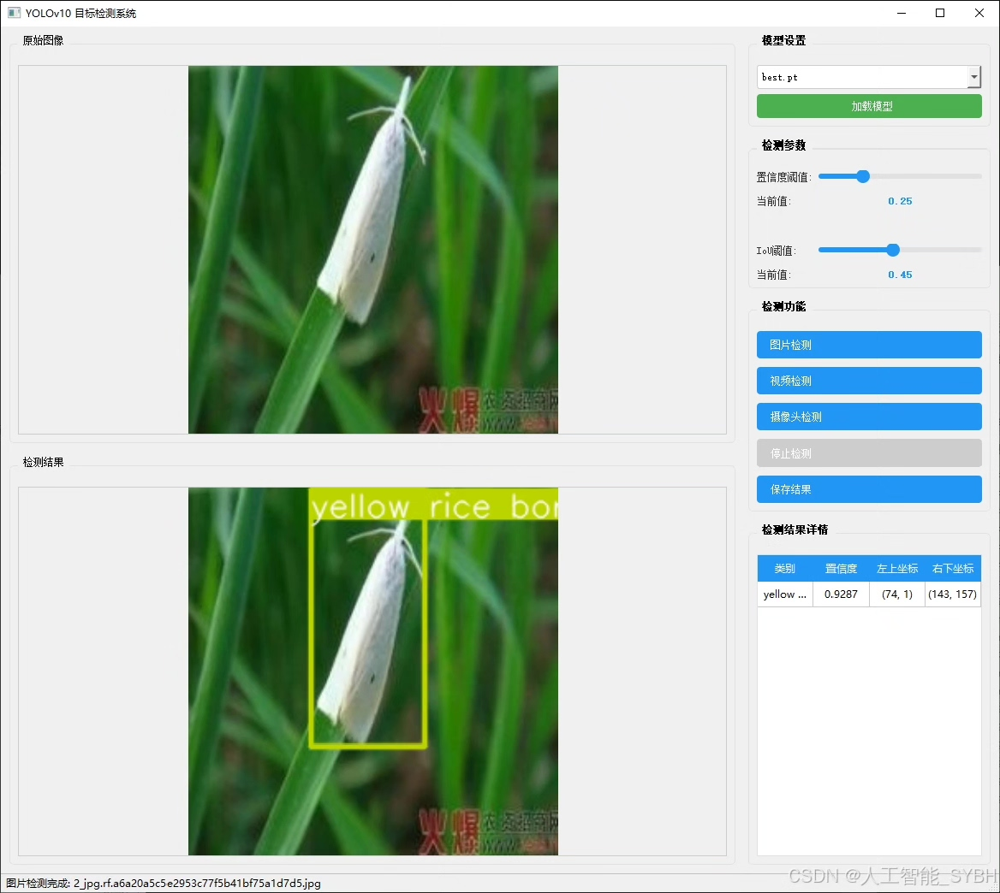
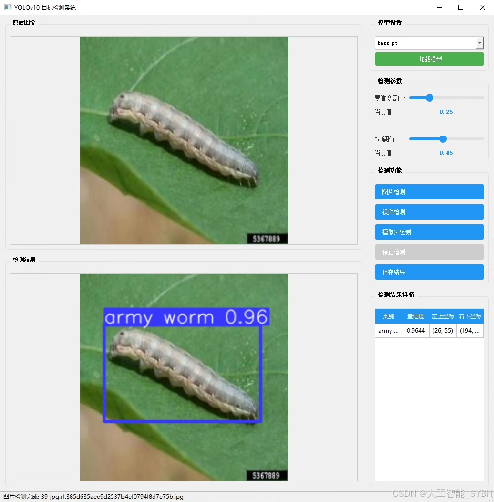
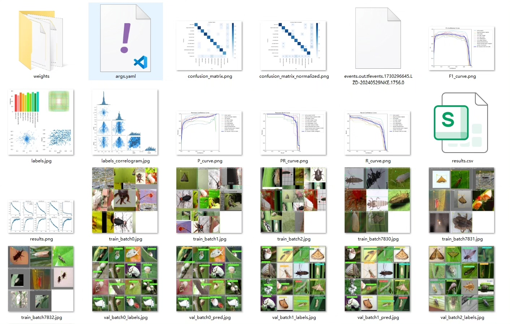
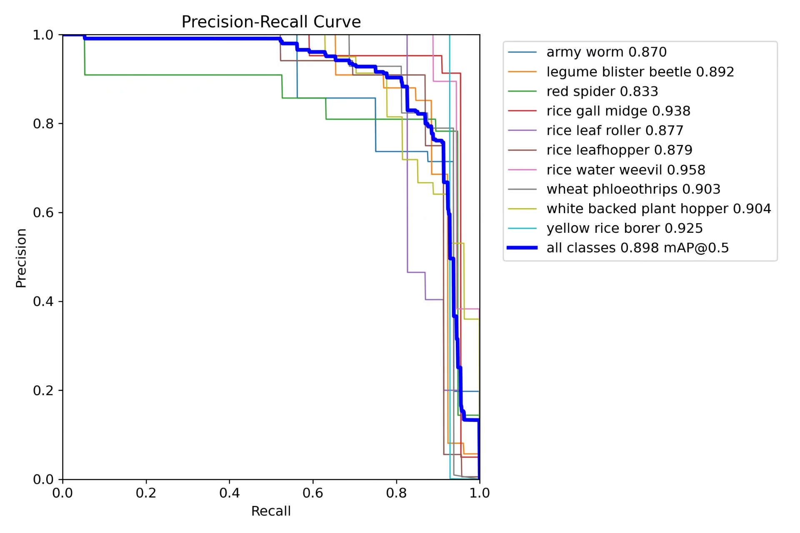
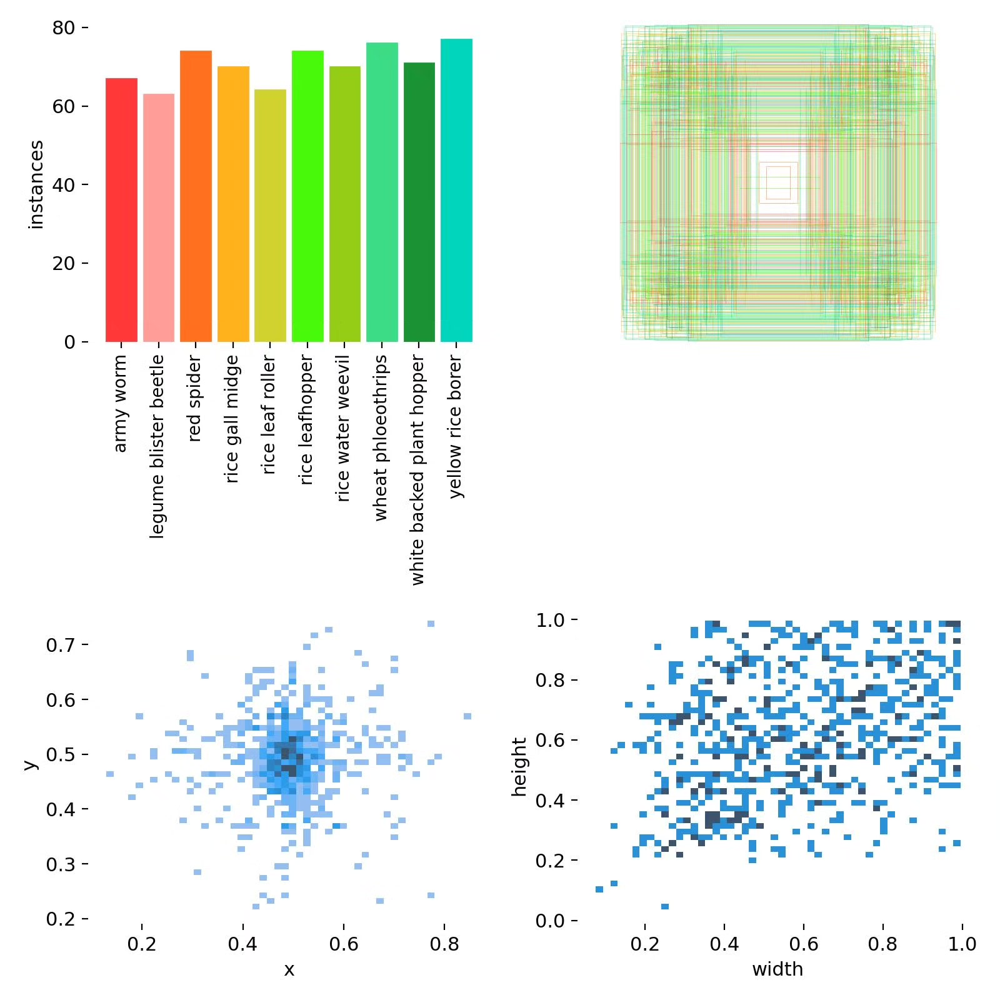
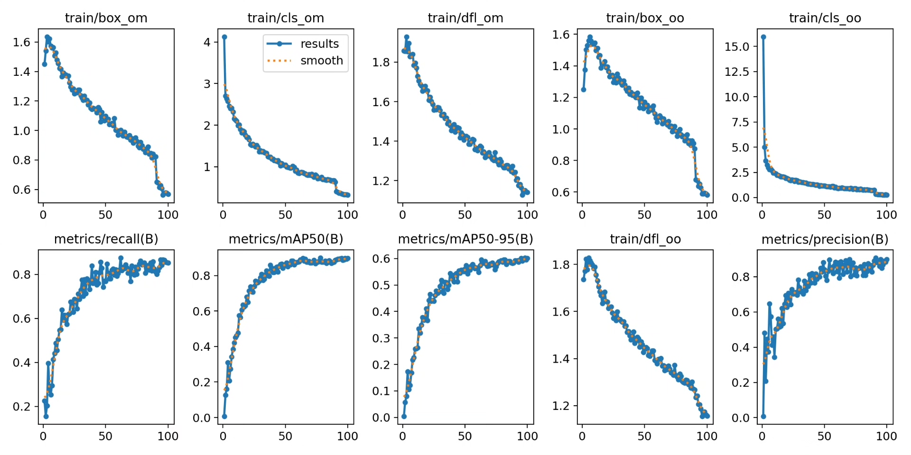
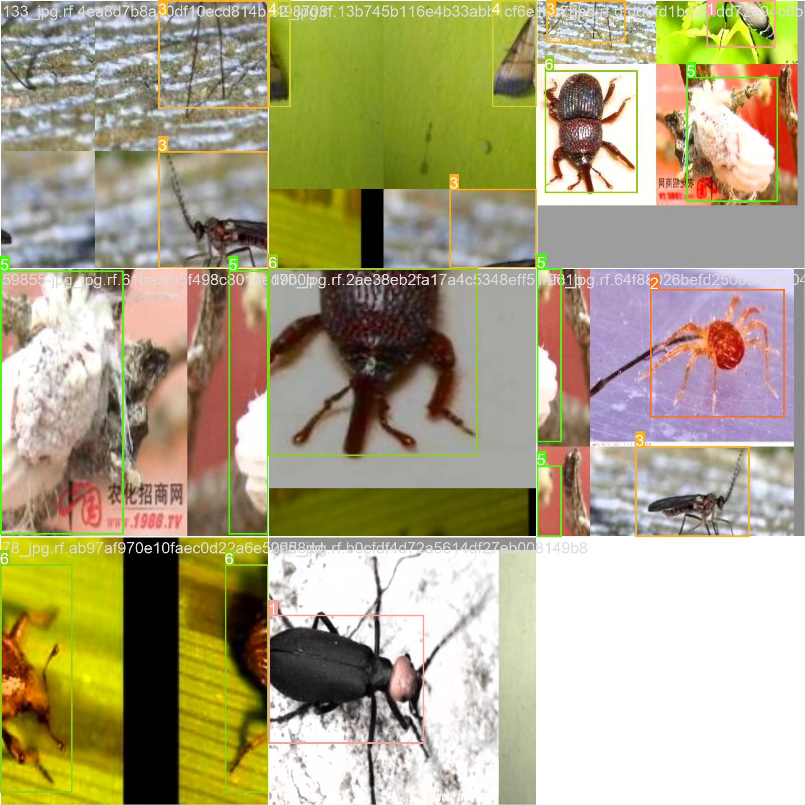
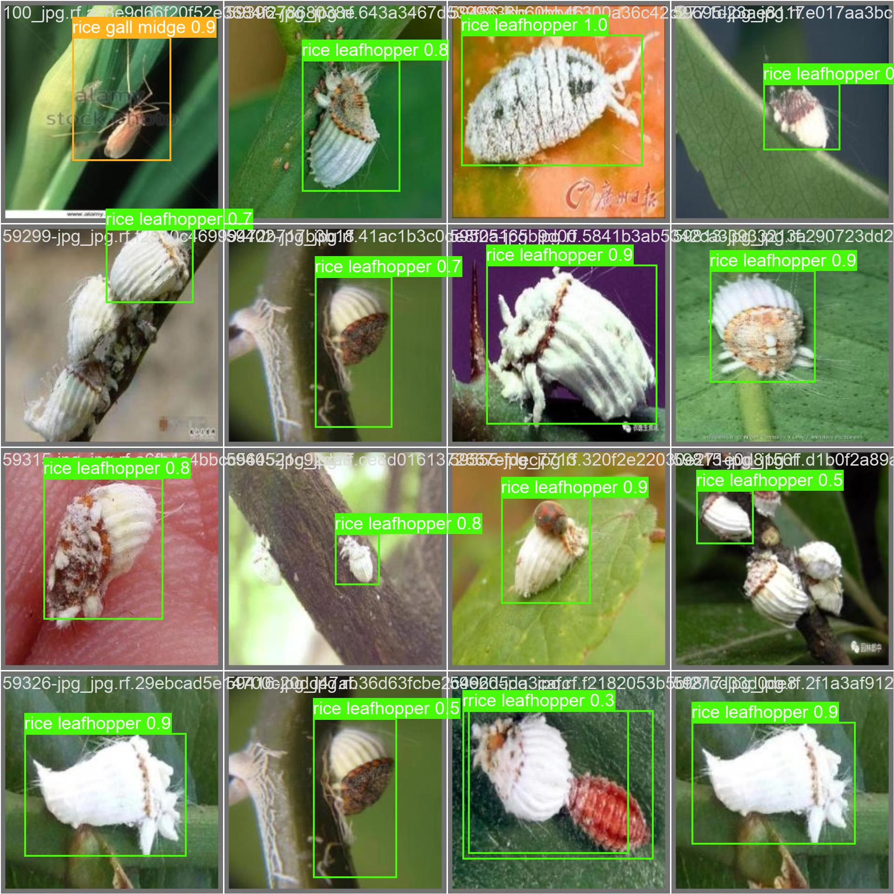

# Insect Detection System Based on YOLOv10 Deep Learning

## Body

Based on the YOLOv10 deep learning model, this system is specifically designed to detect and identify 10 common agricultural pests. These pests include: army worm (sticky insect), legume blister beetle (bean weevil), red spider (red spider mite), rice gall midge (rice leaf roller), rice leafhopper (rice leaf hopper), rice water weevil (rice water bug), wheat phloeothrips (wheat aphid), white-backed plant hopper (white-backed planthopper), and yellow rice borer (three-striped rice borer). The system aims to help agricultural practitioners quickly and accurately identify field pests, thereby taking timely preventive measures to reduce crop losses.

The company's products have obtained YOLO official commercial license certification.

We provide after-sales service.

After payment, we will provide a WeChat account for you to ask questions anytime.

Environmental configuration: We will provide an instructional tutorial on how to configure the environment, and WeChat will provide answers.

Remote installation service: If you need remote configuration, an additional fee of 69 is required,
failure in configuration, all fees are refundable (specially for old computers only refund installation fees)

Retraining dataset: After configuring the environment, you can train on your own computer.
If you need us to retrain, just pay 69+ computing power fees (2.5 yuan/hour)

Full package after-sales service

## Images

## Payment

Here is a pay link on Stripe ( https://buy.stripe.com/3cs8yP7sY87d0vu9AB ). Please contact me lonlonago@foxmail.com after funding $89, and I will send you a complete data files , thank you!

